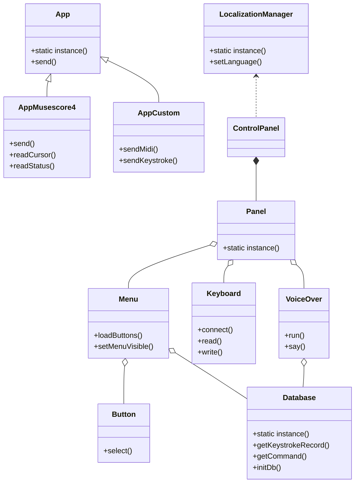

**Progetto ODLA - Documento Tecnico e Architettura**

---

# Cos'è ODLA

ODLA è un sistema informatico multipiattaforma progettato per l'uso di una **tastiera musicale specializzata** che permette di scrivere spartiti musicali premendo dei **bottoni sagomati**.
Il sistema è pensato sia per musicisti che per persone cieche o ipovedenti grazie al supporto di una **Guida Vocale**.

**Componenti principali:**
- Software desktop multipiattaforma (Windows, macOS, Linux)
- Firmware per tastiera custom Arduino
- Plugin per MuseScore (QML)

---

# Architettura Generale

```
+-------------------+
|  Tastiera ODLA    |
+-------------------+
         |
     [Seriale]
         |
+-------------------+       +-------------------+
|  Software ODLA    | <---> |  MuseScore Plugin  |
+-------------------+       +-------------------+
         |
   [SQLite, TTS, JSON Socket]
         |
    [Browser esterno]
```

- **Tastiera ODLA:** hardware fisico che invia segnali MIDI o input tastiera simulato.
- **Software ODLA:** riceve segnali, interpreta e gestisce la scrittura musicale, la Guida Vocale e la comunicazione con MuseScore.
- **MuseScore Plugin:** facilita l'integrazione diretta con MuseScore Studio 4.
- **Database SQLite:** contiene mappature e dati statici.
- **Socket JSON:** comunica dati musicali a software terzi.
- **TTS (Text-to-Speech):** guida vocale.
- **Browser:** apre documentazione o link informativi.

---

# Dettagli Tecnici

## Software Desktop

- **Linguaggio:** C++
- **Framework:** Qt 6 (QML, Widgets)
- **Compilazione:**
  ```
  D:/Qt/6.7.2/mingw_64/bin/qmake.exe D:/KemoniaRiver/ODLA/odla.pro -spec win32-g++ "CONFIG+=qtquickcompiler"
  D:/Qt/Tools/mingw1120_64/bin/mingw32-make.exe qmake_all
  ```

- **Struttura dei moduli:**
  - `serial/` Gestione porta seriale
  - `speech/` Interfaccia text-to-speech multipiattaforma
  - `db/` Accesso al database SQLite
  - `browser/` Apertura di URL
  - `network/` Socket TCP per invio JSON
  - `plugin_musescore/` Plugin per MuseScore


## Database SQLite

- **Driver:** Integrato Qt (QSQLITE)
- **Caratteristiche:**
  - Tabella `keystroke` (~800 righe, accesso molto frequente, dati statici)
- **Esempio di accesso:**
  ```cpp
  QSqlDatabase db = QSqlDatabase::addDatabase("QSQLITE");
  db.setDatabaseName("data/keystroke.db");
  db.open();
  QSqlQuery query("SELECT output FROM keystroke WHERE input = :input");
  query.bindValue(":input", input);
  query.exec();
  ```

## Comunicazione Seriale

- **Porta:** Virtual COM USB
- **Protocollo:** Segnali codificati (MIDI-like e caratteri ASCII)
- **Esempio di ricezione:**
  ```cpp
  connect(serialPort, &QSerialPort::readyRead, this, &SerialManager::handleReadyRead);

  void SerialManager::handleReadyRead() {
      QByteArray data = serialPort->readAll();
      processData(data);
  }
  ```

## Text-to-Speech (TTS)

- **Windows:** `SAPI`
- **macOS/Linux:** `QtTextToSpeech`

- **Esempio:**
  ```cpp
  QTextToSpeech *speech = new QTextToSpeech(this);
  speech->say("Nota DO premuta.");
  ```

## Apertura Browser Esterno

- **Esempio:**
  ```cpp
  QDesktopServices::openUrl(QUrl("https://kemonia-river.github.io/odla_manual"));
  ```

## Socket JSON TCP

- **Uso:** Comunicazione veloce con altri programmi.
- **Esempio di invio dati:**
  ```cpp
  QTcpSocket socket;
  socket.connectToHost("127.0.0.1", 1865);
  socket.write(QJsonDocument(jsonObject).toJson());
  socket.flush();
  ```

---

# Plugin MuseScore (QML)

- **Tecnologia:** QML (MuseScore Studio 4 plugin system)
- **Funzionalità:**
  - Lettura selezioni
  - Inserimento note
  - Gestione delle corone su pause
- **Esempio QML:**
  ```qml
  import MuseScore 3.0

  MuseScore {
      onRun: {
          var cursor = curScore.newCursor();
          cursor.rewind(0);
          while (!cursor.eos()) {
              console.log(cursor.element.type);
              cursor.next();
          }
      }
  }
  ```


---

# Firmware Tastiera ODLA (Arduino)

- **Linguaggio:** C++ (Arduino Framework)
- **Funzionalità principali:**
  - Lettura tasti
  - Invio MIDI via USB (HID) o caratteri seriali

- **Esempio di invio carattere seriale:**
  ```cpp
  Serial.write('C'); // Nota DO
  ```

- **Esempio di invio MIDI:**
  ```cpp
  usbMIDI.sendNoteOn(60, 127, 1); // Nota DO, massima velocità, canale 1
  ```


---

# Struttura dei file principali

```
/ODLA
  |-- odla.pro
  |-- main.cpp
  |-- serial/
  |-- speech/
  |-- db/
  |-- network/
  |-- browser/
  |-- plugin_musescore/
  |-- firmware/
  |-- resources/
  |-- data/ (keystroke.db)
```

---


# Struttura delle Cartelle e Panoramica dei Contenuti

ODLA è organizzato secondo una chiara separazione dei componenti e delle risorse principali:

- `src/` — Contiene tutto il codice sorgente principale in C++ relativo all'applicazione desktop (logiche di interfaccia, gestione tastiera, interazione con MuseScore, menu, pannelli, database, vocalizzazione, ecc.).
- `Musescore_Plugin/` — Contiene un plugin in QML per l’integrazione diretta tra ODLA e MuseScore (lettura/inserimento note dalla tastiera specializzata).
- `singleapplication/` — Libreria di terze parti per assicurare che venga eseguita una sola istanza dell’app desktop.
- `fonts/` — Fonts usati per l’interfaccia e la notazione musicale.
- `installer-mac/` e `installer-win/` — Script, configurazioni e risorse per la creazione degli installer multipiattaforma.
- `readme_imgs/` — Immagini per la documentazione.
- File di progetto, icone, DB SQLite e risorse varie nella root.

# Script di Deploy (installer-mac e installer-win)

Il progetto include strumenti dedicati per automatizzare la creazione di installer per macOS e Windows:

- `installer-mac/`: contiene script Bash (`deploy.sh`), risorse grafiche, config XML/plist, pacchetti e file necessari a firmare o comporre un installer `.dmg`/PKG per Mac. Il deploy.sh cerca la Qt installata, consente di costruire, firmare e impacchettare l'applicazione.

- `installer-win/`: cartelle di immagini, lingue, licenze, binari, insieme a script Inno Setup (`odla.iss`, `musescore_odla.iss`) per creare file di installazione `.exe` completi per Windows con integrazione per MuseScore. Sono previste opzioni multilingua e setup grafico anche personalizzato.

# Plugin MuseScore (cartella Musescore_Plugin)

La cartella `Musescore_Plugin` contiene il plugin ODLA, sviluppato in QML, per integrare la tastiera ODLA con MuseScore:
- Supporta versione MuseScore 4 e precedenti tramite QML.
- Abilita input diretto da tastiera custom ODLA su MuseScore (lettura selezione, inserimento note, funzioni specifiche per utenti non vedenti).
- Facile installazione, file README dedicato e risorsa grafica.

# Codice C++ - Cartella src (componenti principali)

Tutta la logica applicativa è presente in `src/` e organizzata in più moduli/classi. Alcune delle classi e file principali:

- **App** / **App*Musescore/** / **AppCustom**: gestiscono le interfacce con MuseScore, controllano logica, eventi, socket.
- **Database**: incapsula accessi e gestione database SQLite.
- **VoiceOver**: thread TTS per la guida vocale accessibile.
- **Keyboard**: si occupa di interfaccia hardware e segnali della tastiera custom.
- **Panel** / **Menu** / **Button**: grafica principale (tray, menu, pulsanti, interfaccia utente custom)
- **ControlPanel**: finestra principale e punto di gestione centralizzata di molte azioni utente.
- **LocalizationManager**: gestione lingua/interfaccia multilingua.

Di seguito un semplice diagramma delle classi principali (Mermaid):



# Altre Note

- ODLA è progettato per funzionare completamente **offline**.
- Grande attenzione è data all'accessibilità per utenti non vedenti.
- Il progetto segue standard di codifica "Allman Style" per la chiarezza.
